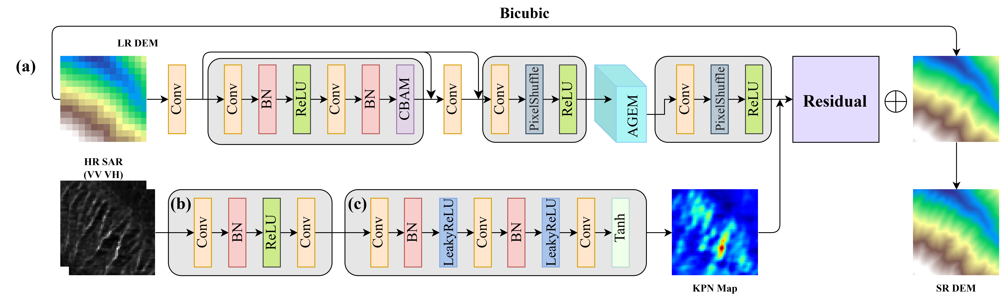
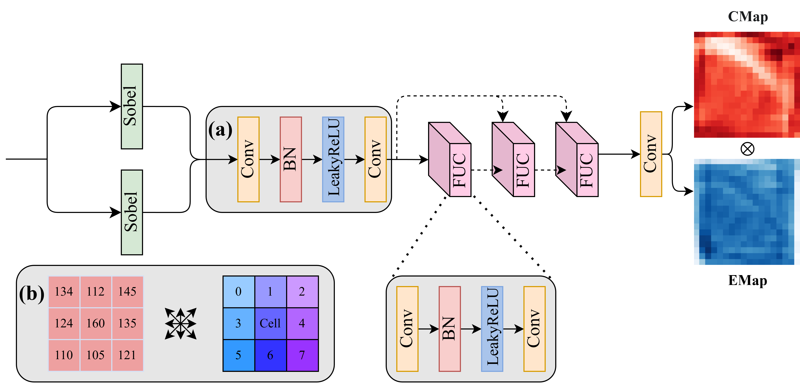

# TGFSR: Terrain-Guided Fusion Network for Super-Resolution

This is the source code for **TGFSR**, a novel deep learning model for super-resolution reconstruction of Digital Elevation Models (DEMs). This model utilizes a unique **Attribute-Guided Iterative Evolution Module (AGEM)** to enhance topographic features and effectively fuses DEM information with Synthetic Aperture Radar (SAR) data, resulting in higher-quality reconstruction results.



### Key Features

*   **Attribute-Guided Iterative Evolution Module (AGEM):** A core innovation that simulates natural erosion and deposition processes by iteratively evolving a "flow field" based on terrain attributes (slope, aspect). This allows the model to explicitly carve out fine-grained geomorphological details like gullies and ridges.
*   **Multi-modal Fusion:** Integrates high-resolution SAR data (VV and VH polarizations) with DEM features using a Kernel Prediction Network (KPN)-inspired module. This allows the SAR texture and structural information to dynamically guide the refinement of DEM elevation values.
*   **Progressive Refinement Architecture:** The network employs a multi-stage, serial architecture that progressively refines features from low-resolution (LR) to medium-resolution (MR) and finally to high-resolution (HR), ensuring stable training and detailed feature learning.
*   **Attention Mechanisms:** Utilizes Convolutional Block Attention Modules (CBAM) in residual blocks to enhance important features and suppress irrelevant ones, improving the model's representational power.
*   **Compound Loss Function:** Employs a combination of three losses for comprehensive optimization:
    1.  **Content Loss (L1):** Ensures pixel-wise accuracy of the generated DEM.
    2.  **Slope Loss:** Explicitly supervises the consistency of terrain slope, preserving topographical correctness.

 

### Model Architecture

The `GeneratorSerialAGEM` follows a carefully designed serial pipeline:

1.  **Shallow Feature Extraction:** An initial convolution layer extracts basic features from the Low-Resolution (LR) DEM input.
2.  **Deep Feature Extraction (LR Space):** A series of `ResidualBlockCBAM` modules process the shallow features to learn complex representations at the LR scale.
3.  **Upsample to Mid-Resolution (MR):** The LR features are upsampled (x2) to an intermediate resolution using a `PixelShuffle` layer.
4.  **Geomorphological Refinement (MR Space):** The core `AGEM` blocks are applied at this stage. They analyze the upsampled features to generate convergence and entropy maps, which are then used to enhance potential gully and ridge features.
5.  **Upsample to High-Resolution (HR):** The refined MR features are upsampled again (x2) to the target high resolution.
6.  **SAR-DEM Fusion:** The `SarDemFusionModule` takes the upsampled HR DEM features and the HR SAR input. It uses a KPN-like structure to generate a dynamic modulation map from SAR features, which then refines the DEM features. This module outputs a final residual.
7.  **Final Output:** The learned residual is added to a bicubic-interpolated version of the original LR DEM to produce the final High-Resolution (HR) DEM output.

### Prerequisites

*   python 3.11.13
*   pyTorch 2.1.1+cu118
*   torchvision==0.16.1+cu118
*   torchaudio==2.1.1+cu118
*   numpy==1.26.0
*   gdal==3.9.2
*   scikit-image
*   matplotlib==3.10.6
*   tqdm==4.67.1

You can install the required packages using pip:
```bash
pip install torch torchvision torchaudio
pip install numpy gdal scikit-image matplotlib tqdm
```

### Dataset Preparation

Organize your dataset into the following directory structure. The filenames for corresponding LR, HR, and SAR images should be identical.

```
/path/to/your/dataset/
├── train/
│   ├── HR/         # High-Resolution DEMs (*.tif)
│   ├── LR/         # Low-Resolution DEMs (*.tif)
│   ├── SAR_VV/     # SAR VV-polarization images (*.tif)
│   └── SAR_VH/     # SAR VH-polarization images (*.tif)
├── val/
│   ├── HR/
│   ├── LR/
│   ├── SAR_VV/
│   └── SAR_VH/
└── test/
    ├── HR/
    ├── LR/
    ├── SAR_VV/
    └── SAR_VH/
```

### Usage

#### Training

To train the model from scratch, run the `train.py` script. Adjust the arguments as needed.

```bash
python train.py \
    --dataroot /path/to/your/dataset/train \
    --val_dataroot /path/to/your/dataset/val \
    --out /path/to/save/results \
    --nEpochs 100 \
    --batchSize 16 \
    --lr 5e-5 \
    --upSampling 4 \
    --n_res_blocks 1 \
    --n_agem_blocks 1 \
    --agem_iterations 3 \
    --slopeWeight 0.2 \
    --augment false
```

**Key Training Arguments:**
*   `--dataroot`: Path to the training dataset.
*   `--val_dataroot`: Path to the validation dataset.
*   `--out`: Directory to save checkpoints, logs, and visualizations.
*   `--n_res_blocks`, `--n_agem_blocks`: Number of residual and AGEM blocks.
*   `--agem_iterations`: Number of internal iterations within each AGEM block.
*   `--slopeWeight`, `--psdWeight`: Weights for the respective loss components.
*   `--augment`: Set to `true` to enable data augmentation (flips, rotations).
*   `--auto_resume`: Automatically resume training from the `latest_model.pth` checkpoint in the output directory.

#### Testing

To evaluate a trained model, use the `test.py` script.

```bash
python test.py \
    --model_path /path/to/save/results/best_rmse_model.pth \
    --test_dir /path/to/your/dataset/test \
    --output_dir /path/to/save/test_outputs \
    --upsample_factor 4 \
    --n_res_blocks 1 \
    --n_agem_blocks 1
```

**Key Testing Arguments:**
*   `--model_path`: Path to the trained model checkpoint (`.pth` file).
*   `--test_dir`: Path to the test dataset.
*   `--output_dir`: Directory to save the generated GeoTIFF images and a `test_results.txt` file with evaluation metrics (RMSE, MAE, PSNR, SSIM).

### File Descriptions

*   `TGFSR_AGEM_model.py`: Contains the core model architecture, including `GeneratorSerialAGEM`, `AGEM`, `SarDemFusionModule`, and attention blocks.
*   `train.py`: The main script for training the model. Handles data loading, training loop, validation, logging, and checkpointing.
*   `test.py`: Script for evaluating the trained model on a test set. It calculates metrics and saves the output images as GeoTIFFs.
*   `loss.py`: Defines the Power Spectral Density (PSD) loss function. It works better not to use this loss function.
*   `dem_features.py`: Implements the `Slope` module, which calculates terrain slope using Sobel filters for use in the loss function.
*   `visualization.py`: A utility function to generate and save comparison images (LR, Bicubic, SR, HR) during training.
